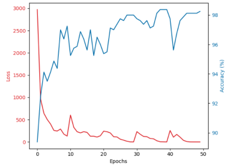

.. Resource Constrained Federated Learning documentation master file, created by
   sphinx-quickstart on Wed Oct  7 21:05:56 2020.
   You can adapt this file completely to your liking, but it should at least
   contain the root `toctree` directive.

Resource Constrained Federated Learning
=======================================

.. toctree::
   :maxdepth: 4
   :caption: Contents:

   modules

Indices and tables
==================

* :ref:`genindex`
* :ref:`modindex`
* :ref:`search`

Charts
======

   Fig 1. Loss and Accuracy during sample run.